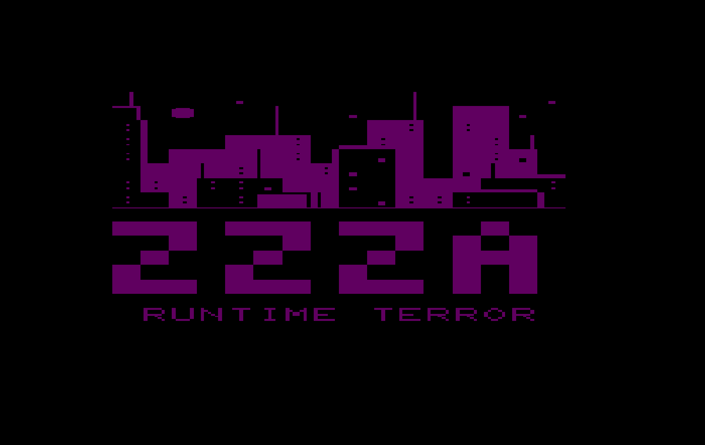

Welcome to the world of Zzza. This is the cyberpunk dystopia of Neo-Tokyo, a vast, neverending sea of super-hi-rise towers and neon lights. Many things have changed in the far future, but one thing at least has stayed the same - the people’s need for pizza.

Here to fill that need is our hero, Eva. Even though she’d rather be out skateboarding or chilling with her friends, she’s picked up a part time position as a delivery girl at Tower of Zzza, the best pizza joint in town, inconveniently located on the 305th floor of New Tokyo Tower.

Eva’s boss is the malevolent Robini, a ‘za-slinging robot built just for this task. Robini just recently introduced a customer guarantee: 30 minutes or it’s free! There’s no way Eva can do the task on foot - she’ll have to hop on her trusty skateboard and slide down the skyscraper to get those pies delivered on time!

# ZZZA

ZZZA is a 2022 Retrogame written for the [Commodore VIC-20](https://en.wikipedia.org/wiki/VIC-20) in 6502 Assembly. The game and all assets fit in the unexpanded VIC's 3583 bytes of available RAM.

### Authors
The Runtime Terror Team:
- [Dylan Leclair](https://github.com/dylanleclair)
- [Jeremy Stuart](https://github.com/jgpstuart)
- [Emily Baird](https://github.com/e-baird)

With much guidance from [Dr. John Aycock](https://pages.cpsc.ucalgary.ca/~aycock/).

Additionally, makes use of [ZX02](https://github.com/dmsc/zx02) for compression and decompression of the title screen and music.

## Assembling and Running

1. Install the DASM assembler: https://dasm-assembler.github.io/
2. Assemble: run `make` from within the `/zzza` directory
    - this will produce an outfile called `main.prg`, as well as a list file with memory locations for debugging.
3. The `main.prg` file can then be used in any [VICE](https://vice-emu.sourceforge.io/) emulator for the VIC.

## Gameplay

Your goal is to clear all the rows of each level without falling off the bottom or getting pushed off the top of the screen. Once you reach the bottom of a level, a door will appear where Eva can deliver her pizza. Push and stomp blocks to get out of tricky spots and keep moving.

#### Basic character movement:
- `A`: move left
- `D`: move right

#### Block manipulation:
- `S`: stomp the block directly below you
- `Press and hold A`: push the block directly to the left
- `Press and hold D`: push the block directly to the right

#### Misc:
- `M`: mute music for the rest of the level
- `K`: restart the level and lose a life

## Development
ZZZA was written over the course of four months, from September to December 2022.

For some slapdash notes about how things are implemented, check out the [Technical Writeup](./technical-writeup.md).